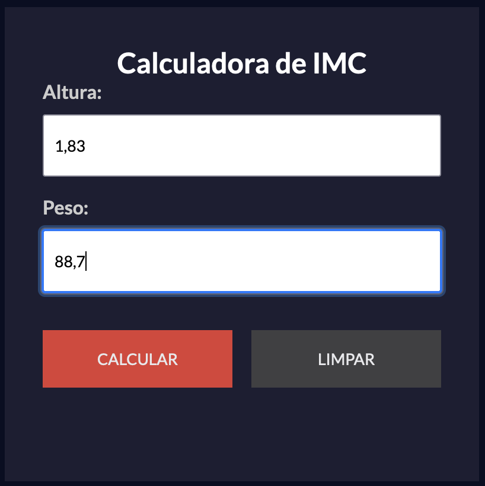

# Calculadora de IMC (Índice de Massa Corporal)

Este é um projeto de calculadora de IMC desenvolvido utilizando HTML, CSS e JavaScript. A calculadora permite que os usuários insiram seu peso e altura para calcular o IMC e fornecer uma avaliação do estado nutricional.

## Demonstração




## Tecnologias Utilizadas

- HTML
- CSS
- JavaScript

## Funcionalidades

- Calcula o Índice de Massa Corporal (IMC) com base no peso e altura inseridos pelo usuário.
- Fornece uma avaliação do estado nutricional com base no resultado do IMC.

## Instalação

1. Clone o repositório:
   ```bash
   https://github.com/fabrciovvieira/CalculadoraIMC.git
